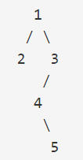
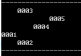

# leetcode-tool

## 一：说明
在刷leetcode题目的时候，我总结了一些编写测试用例的辅助函数，用于方便地生成和输出array, vector, list, tree, 希望对大家有帮助

## 二：API说明
### 1. 通用数据结构

	//链表结点
	struct ListNode
	{
    	int val;
    	ListNode *next;
    	ListNode(int x) : val(x), next(NULL) {}
	};

	//树结点
	struct TreeNode 
	{
    	int val;
    	TreeNode *left;
    	TreeNode *right;
    	TreeNode(int x=0) : val(x), left(NULL), right(NULL) {}
	};

### 2. 数据操作
	//输出数组
	void Print(int arr[], int count);

### 3. vector操作
	//输出vector<int>
	void Print(const vector<int> &vec);

	//输出vector< vector<int> >
	void Print(const vector< vector<int> > &vec);

	//输出vector<string>
	void StringVectorPrint(const vector<string> &vec);

### 4. list操作
	//创建，销毁，输出链表
	ListNode *ListCreate(const vector<int> &vec);
	void DestroyList(ListNode *head);
	void ListPrint(ListNode *head);

### 5. 二叉树操作
	//创建，销毁，输出二叉树（详细解释请见下文）
	TreeNode *TreeCreate(const vector<int> &vec);
	void DestroyTree(TreeNode *root);
	void TreePrint(TreeNode *root);

## 三：tree详解
数组，vector，list的操作都很简单，就不多作解释了。下面重点解释一下tree的创建和输出。 
#### 1. 假设一棵树如下： 

#### 2：那么leetcode上的表示是：
{1,2,3,#,#,4,#,#,5}

#### 3. 创建的代码是这个样子的：
	//在代码中，#用INT_MAX代替
	vector<int> treeVec = {1, 2, 3, INT_MAX, INT_MAX, 4, INT_MAX, INT_MAX, 5};
	TreeNode *tree = TreeCreate(treeVec);
    TreePrint(tree);
    DestroyTree(tree);

#### 4. 输出的结果是这个样子的：

## 使用示例
详情请自行查看文件main.cpp